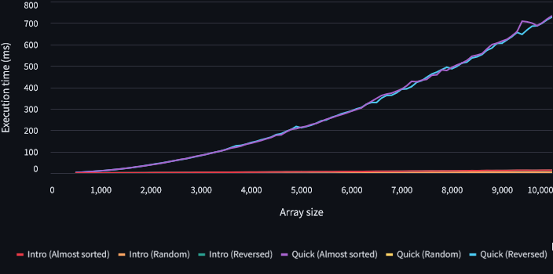
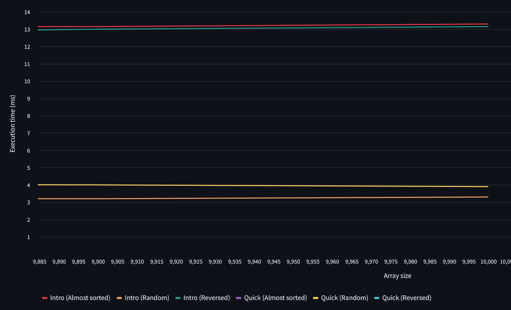

# [ЛУЧШЕ СРАЗУ ОТКРЫТЬ ТУТ](https://github.com/seny03/merge-insertion-sort)
# Intro Sort

#### 1. [Реализован](source/sort_tester.cpp) класс **ArrayGenerator** для генерации тестовых массивов, заполненных целыми числами в трех режимах:
* массив случайных чисел
* массив случайных чисел, отсортированных в обратном порядке
* массив случайных чисел, почти отсортированный в правильном порядке

Также реализованы **Quick Sort**, **Insertion Sort**, **Heap Sort**, **Intro Sort** и класс **SortTester** для измерения времени работы сортировок.

#### 2. Эмпирический анализ стандартного алгоритма Quick Sort
Проведены замеры времени работы стандартной реализации алгоритма **Quick Sort** на различных тестовых данных. Графики будут в пункте 4.

P.S. в Visual Studio пришлось поднимать размер стэка, иначе рекурсия **Quick Sort** его переполняла.
Дополнительная информация:
* Отключены все остальные программы, чтобы минимизировать их влияние.
* Для обеих сортировок и каждого вида тестовых данных проведено по 100 замеров, и их результаты усреднены.
* В качестве единиц измерения выбраны миллисекунды.

#### 3. Эмпирический анализ гибридного алгоритма Intro Sort
Анализ выполнен аналогично анализу в пункте 2.

#### 4. Сравнительный анализ

В приближенном виде:

* Как видно из графика, **Intro Sort** работает быстрее обычного **Quick Sort** на каждом виде данных.
* Видно, что **Intro Sort** ведет себя более стабильно, скорость работы практически не меняется на разных видах данных, в отличие от обычного **Quick Sort**.
* Для обоих алгоритмов сортировка обратно отсортированных и почти отсортированных массивов занимает почти одинаковое количество времени.
* Для обоих алгоритмов сортировка обратно отсортированных и почти отсортированных массивов занимает больше времени, чем сортировка случайных массивов.
* *Intro Sort* совсем немного лучше *Quick Sort* на случайных данных, но на специфичных *Intro Sort* оказывается гораздо быстрее.

#### 5. Дополнительное
1. [Реализации ArrayGenerator и SortTester](source/sort_tester.cpp)
2. id посылки на codeforces: _[293154830](https://dsahse.contest.codeforces.com/group/NOflOR1Qt0/contest/565612/submission/293154830)_
3. [ссылка на репозиторий](https://github.com/seny03/intro-sort)
